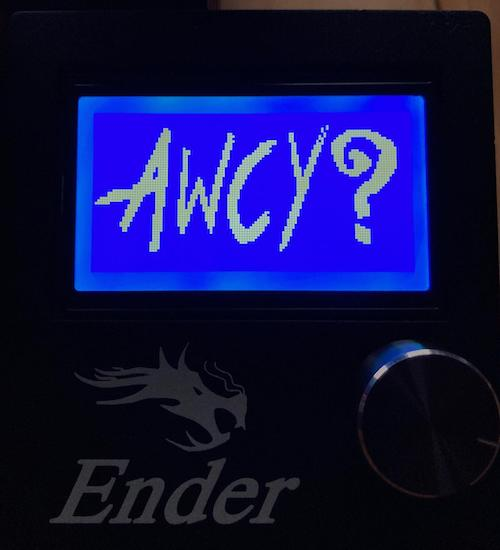
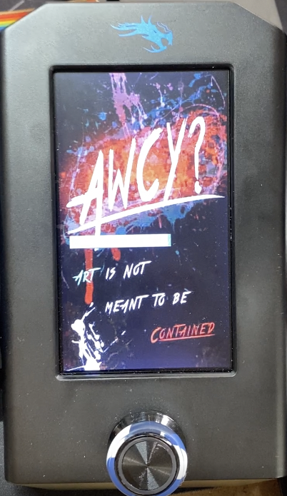

# AWCY? Custom Bootscreens for Marlin

This README explains how to add custom AWCY? bootscreens to many printers, as well as how to build your own. Spoiler alert: if you have a fancy full color screen on a Creality printer (or a Creality clone), you probably want to check if it is a DWIN LCD printer. If it is, you can head over to [this sister project](https://gitlab.com/capekoviroboti/creality-dwin-lcd-customizer) instead. If you are a pleb with a pixel screen, this document is for you.

## Graphical LCD printers (Many printers including the Creality Ender 3/Ender 3 Pro/Ender 5/CR10)

### Prerequisite: Working Marlin build
These instructions assume you already have a working build of Marlin setup using [VSCode](https://code.visualstudio.com) + [PlatformIO](https://platformio.org) + [Auto Build Marlin](https://marlinfw.org/docs/basics/auto_build_marlin.html). If you don't, it is highly recommended that you first successfully set that up and get some firmware that you compiled working on your printer before you attempt adding custom display. There are a lot of guides available that cover how to do this, so search for one that covers your specific printer, eg [this one for older Ender 3s](https://rants.tech/upgrading-creality-ender-3-and-ender-5-to-marlin-2-x/). This ensures that if something goes wrong, you know that you will be able to put your printer back into a working state by recompiling and reflashing.

If you need some help getting set up, Marlin has a [guide covering how to install PlatformIO](https://marlinfw.org/docs/basics/install_platformio.html) and a [guide covering how to install Auto Build Marlin on VSCode](https://marlinfw.org/docs/basics/install_platformio_vscode.html).
If you are Windows, [this guide](https://www.reddit.com/r/ender3v2/comments/k9v8oc/compilingbuilding_marlin_firmware_in_windows_with/) covers an alternative option without using VSCode.

### Adding the custom bootscreen:

Printers with graphical LCD displays can have custom bootscreens / status screens, but the image displayed must be in the form of a bitmap turned into an array in specific C++ header files. 
We have already done this step for you, using [this tool](https://marlinfw.org/tools/u8glib/converter.html) from Marlin to generate the header files. The resulting files are named:

* `_Bootscreen.h`
* `_Statusscreen.h`

Multiple versions of these files can be found in the `premade-screen-files` directory in this repository. For Marlin version 1.0 or 1.1 use `premade-screen-files/1/<Bootscreen version>/*.h` and for Marlin version 2+ use `premade-screen-files/2/<Bootscreen version>/*.h`.

Choose one of the bootscreen versions, then copy the `_Bootscreen.h` file into the `Marlin/Marlin` directory; this should be parallel to where you can find the `Configuration.h` file. Once this file has been copied over you will need to enable your custom bootscreen by turning on `SHOW_CUSTOM_BOOTSCREEN` in `Configuration.h`.

Open `Marlin/Marlin/Configuration.h` in a code editor and find the line matching one of the two below:

* `//#define SHOW_CUSTOM_BOOTSCREEN`
* `#define SHOW_CUSTOM_BOOTSCREEN`

If the line starts with the two forward slashes `//`, delete them so that the line reads `#define SHOW_CUSTOM_BOOTSCREEN`. If the line already reads that, you don't need to do anything.

Similarly, if you want to enable the custom status screen, do the same thing for the `_Statusscreen.h` file: copy it over to the same directory as the bootscreen file, then open `Marlin/Marlin/Configuration.h` and enable `CUSTOM_STATUS_SCREEN_IMAGE`.

Now save `Configuration.h` and open up VSCode; using Auto-Build Marlin, clean up your last build and build a new copy of the firmware. Once the build has completed, follow the usual process for flashing it on to your printer. Since this is printer-specific it is beyond the scope of this article, however most printers will have significant documentation available about how to do this.

### Building your own custom bootscreen

If this just whet your appetite and now you thirst for the ability to make your own custom bootscreen, here is how you do it. Instead of using one of the `_Bootscreen.h` / `_Statusscreen.h` files we have included here, head over to [here](https://marlinfw.org/tools/u8glib/converter.html).
From there you should upload the image you want to use.
2-color images will work much better, so it may take some experimenting to figure out what looks good.
Note that the file you upload should be 128 x 64 (128 pixels wide and 64 pixels tall) at most.
Maxing this out and using a 128x64 file tends to look best on the printer.

Next select `1.x` if you are running an older Marlin (\*cough\* upgrade \*cough\*), or `2.x` if you ~~live in the 21st century~~ are using a recent version of Marlin.
Use the bottom radio buttons to first select `Boot`. You can play around with the other settings and see what looks good to you.

Once you have the settings you like, copy the resulting text into a file named `_Bootscreen.h` that you place in `Marlin/Marlin`.

If you want a matching status screen, select `Status` in the radio buttons.
Then play with the settings to decide whether you want to include a fan, nozzle, etc on the image. Once you have a setup you like, copy the resulting text into a file named `_Statusscreen.h` that you place in the `Marlin/Marlin` directory.

Then, simply follow the directions above to build the firmware.

## Creality DWIN LCD printers

If you have a printer with a Creality DWIN LCD (or a Creality clone), you will be able to compile significantly more fancy and customized screen firmware. However, the documentation and tools to do that can be found in [this sister project](https://gitlab.com/capekoviroboti/creality-dwin-lcd-customizer) instead. Head over there to start experimenting.
